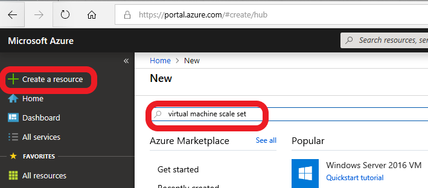
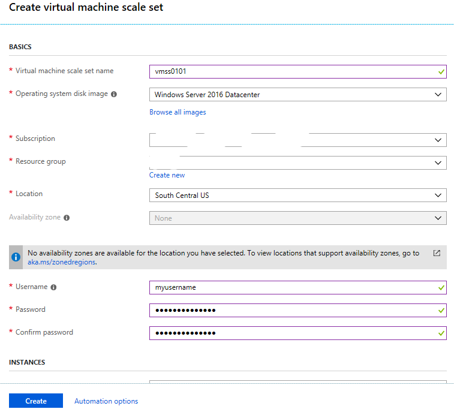
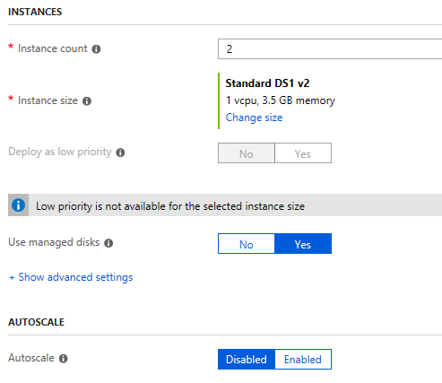
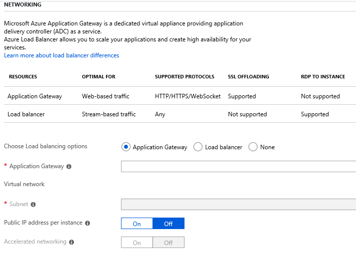

# Playing with VMSS
We should start by creating a toy virtual machine scale set and then exploring the resultant resources. You have the following tools for doing so
* The azure [portal](https://portal.azure.com) is the easiest way to get the resource created
* Azure command line tools like the powershell SDK are also possible but need more familiarity for the uninitiated. [Read about those](https://docs.microsoft.com/en-us/powershell/azure/install-az-ps?view=azps-1.2.0) 
* The azure [resources](https://resources.azure.com/) view is great to understand how all the resources are laid out for a more advanced user.

For now, we will use the portal since it is the easiest one to talk about. We will discuss the others at a later point of time

> This chapter and the <a href="Chapter3.md">next one</a> are most likely to become outdated and look different from when you look at it. So use this chapter as a way to understand the background concepts.

## Using the azure portal to create a sample VMSS
In case you don't have an azure subscription to play with, please start [here](https://azure.microsoft.com/en-us/free/)
Once you do have an azure subscription, start by logging into the [portal](https://portal.azure.com), selecting the "Create a resource" and then putting "virtual machine scale set" in the search.

You should see a screen similar to this one show up

You are being asked to make a few selections which immediately exposes you to some new concepts. Lets walk through them 1-by-1

### Possible new concepts while creating a VMSS
* It is easy to understand that you are being asked to select a name, the operating system (choose between several flavours of Windows and Linux), the subscription (in case you own more than 1), the location where you want your VMs to be created.
* Being asked to choose a username and password for your VMs is also not surprising.
* However, there are 2 new concepts here
  * **Resource group**: It is a way to logically group azure resources such that they can be managed together. See a [detailed explanation](https://theithollow.com/2016/07/18/azure-resource-groups/)
  * **Availability zone**: This is a way to protect your service from datacenter-wide failures. See [explanation](https://docs.microsoft.com/en-us/azure/availability-zones/az-overview)

## But wait, there is more data to fill!

### More new concepts
* Instance count and size should make sense because they were the same in PAAS, though the size names are [different](https://docs.microsoft.com/en-us/azure/virtual-machines/windows/sizes) now.
* However, there are a few new things like
  * **Low priority**: If you don't mind having your workflow interrupted, these bring huge [cost savings](https://docs.microsoft.com/en-us/azure/virtual-machine-scale-sets/virtual-machine-scale-sets-use-low-priority)
  * **Managed disks**: VMSS allows you to add extra disks to your VMs on top of the 2 intial disks, all of which are backed by Azure storage accounts. By selecting [managed disks](https://docs.microsoft.com/en-us/azure/virtual-machines/windows/managed-disks-overview), you can let Azure decide how to handle storage allocations.
  * **Autoscale**: If you have used [scaling](https://docs.microsoft.com/en-us/azure/cloud-services/cloud-services-how-to-scale-portal) your cloud service size up or down based on load before, this should be familiar already. If you haven't done this, please read up about on [autoscale for VMSS](https://docs.microsoft.com/en-us/azure/virtual-machine-scale-sets/virtual-machine-scale-sets-autoscale-overview)

## And even more!

* And now we get to networking preferences, where you are first given a choice between [Application gateway](https://docs.microsoft.com/en-us/azure/application-gateway/overview) and a [load balancer](https://docs.microsoft.com/en-us/azure/load-balancer/load-balancer-overview)
  * If you are unsure about networking, and all you care for is HTTP/HTTPS traffic (which may be all you used in PAAS), going with application gateway is a fine choice
  * If you need to support other forms of traffic (e.g. UDP), or are ready to leverage other traffic splitting patterns, or are exploring solutions like [service fabric](https://docs.microsoft.com/en-us/azure/service-fabric/service-fabric-overview), then load balancer is the better choice
* If you do decide to select load balancer here, you will be asked to configure a public IP address, a domain name label (pick a subdomain under [region].cloudapp.com), VNet etc.

Once you have answered those questions, you can create your VMSS and are ready to explore things.

## Some parting thoughts
### Note about Azure Key Vaults
It is possible to create cloud services and never have to worry about managing secrets or certificates until the next deployment.
So you can stash all your secrets and certs into a [password manager](https://en.wikipedia.org/wiki/List_of_password_managers) and feed them in during the deployment.
Cloud service was created before [Azure Key Vault](https://docs.microsoft.com/en-us/azure/key-vault/key-vault-whatis) came along and it doesn't take a hard dependency on it.
However, almost everything in VMSS literature assumes secrets are kept in Azure Key Vaults, so please take some time to familiarize yourself with them if you have never tried them before

### FAQ on VMSS
VMSS has an excellent page on [frequently asked questions](https://docs.microsoft.com/en-us/azure/virtual-machine-scale-sets/virtual-machine-scale-sets-faq).
It answers a bunch of common asks from customers and you should read through it to be see if it helps answer any remaining questions for you.

**Navigation**: <a href="Introduction.md">First<a> | <a href="Chapter1.md">Prev</a> | <a href="Chapter3.md">Next</a> | <a href="Chapter6.md">Last</a>
