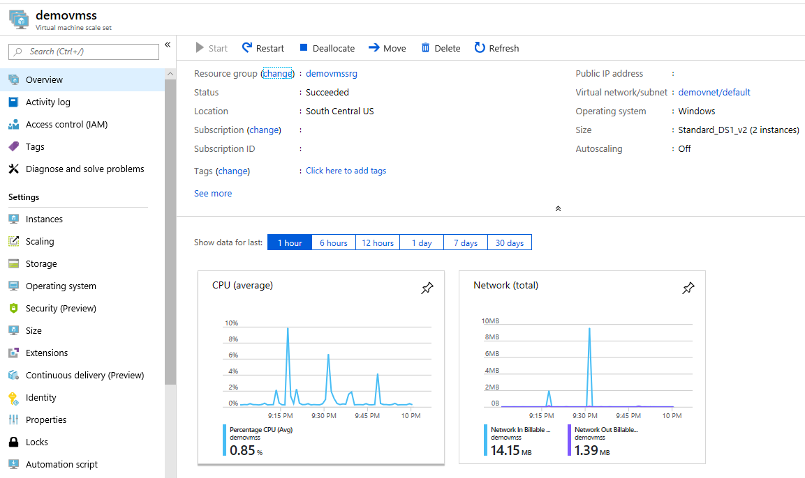

# Exploring the toy VMSS we created
Now that we have created a test virtual machine scale set, lets poke arouund a bit. Below are 3 common ways to look at azure resources each with its own strengths. I find it useful to try them all so that I end up with a better picture of what is possible.

## Exploring via the portal
The portal is reachable at https://portal.azure.com/
> This chapter and the <a href="Chapter2.md">previous one</a> are most likely to become outdated and look different from when you look at it. So use this chapter as a way to understand the background concepts

### Start with the objects in the resource group

In this case, I created the VMSS with a load balancer, so I got the following in the resource group
* My VMSS named demovmss
* Networking elements like a load balancer, a public IP address, a network security group and a VNet. To me, this is the first thing that stands out when I compare this setup against the traditional cloud service.

### Looking at the networking components
Azure has some great [documentation](https://docs.microsoft.com/en-us/azure/networking/networking-overview) on how to plan and architect your networking setup, and they published this really good visual explanation of things 

(C) Microsoft

In our case, we are looking at the left most white block.
* Our VMSS is a collection of VMs enveloped in a network security group ([NSG](https://docs.microsoft.com/en-us/azure/virtual-network/security-overview)) inside a Virtual Network ([VNet](https://docs.microsoft.com/en-us/azure/virtual-network/virtual-networks-overview))
* Each VM has a (virtual) network interface card ([NIC](https://docs.microsoft.com/en-us/azure/virtual-network/virtual-network-network-interface)) which is connected to an external load balancer
* There is a [public IP](https://docs.microsoft.com/en-us/azure/virtual-network/virtual-network-public-ip-address) address infront of the [load balancer](https://docs.microsoft.com/en-us/azure/load-balancer/load-balancer-overview), so any traffic sent to the IP address from the Internet makes it way to the VMs

### Looking at the VMSS and its constituent VMs ###

Look at the entries in the 1st column of the image and you should see quite a few useful things. The settings that I find the most useful are
* **Instances** lets you see every VM separately and how they are behaving
* **Scaling** lets you change the number of VMs and configure [autoscale](https://docs.microsoft.com/en-us/azure/virtual-machine-scale-sets/virtual-machine-scale-sets-autoscale-overview). Similarly, **Size** lets you change the size of your VMs. Compare different VM sizes [here](https://docs.microsoft.com/en-us/azure/virtual-machines/windows/sizes)
* **Storage** would let you add more disks to the VMs (you can pick SSDs and stripe them for different RAID configurations). Read more about disks [here](https://docs.microsoft.com/en-us/azure/virtual-machines/windows/about-disks-and-vhds?toc=%2Fen-us%2Fazure%2Fvirtual-machine-scale-sets%2FTOC.json&bc=%2Fen-us%2Fazure%2Fbread%2Ftoc.json)
* **Extensions** are what make VMSS shine, since you can now configure all sorts of interesting things like [Bitlocker](https://docs.microsoft.com/en-us/azure/security/azure-security-disk-encryption-overview), [Desired State Configuration](https://docs.microsoft.com/en-us/azure/virtual-machine-scale-sets/virtual-machine-scale-sets-dsc) or vanilla scripts (called [custom extensions](https://docs.microsoft.com/en-us/azure/virtual-machines/extensions/custom-script-windows))
* **Identity** is interesting as a way to authenticate against other resources securely. Read more about it [here](https://docs.microsoft.com/en-us/azure/active-directory/managed-identities-azure-resources/overview)
* **Automation script** is very useful, but we shall talk about those when we discuss Azure Resource Manager (ARM) later

**Instances**, **Scaling** and **Size** aren't novel if you move from cloud services, but the rest are very cool and useful concepts to dig into.
You can configure your VMSS to allow remote desktop as well as this [discussion](https://stackoverflow.com/questions/47199368/how-to-rdp-into-azure-vmss-vms) hints at, but you will have to understand ARM before that.

## Exploring via the commandline
Azure resources like VNets/IP Addresses/VMSS can also be explored via the command line from powershell. If you are merely experimenting, you can start with [powershell on Azure cloud shell](https://docs.microsoft.com/en-us/azure/cloud-shell/quickstart-powershell) accessible from the portal. Once it feels more familiar, install it locally and get started from [here](https://docs.microsoft.com/en-us/powershell/azure/overview?view=azps-1.2.0). There is extensive documentation on how to manage azure resources, e.g. here is the list of applicable commands for [VMSS](https://docs.microsoft.com/en-us/powershell/module/az.compute/?view=azps-1.2.0#vm_scale_sets)

## Exploring via azure resources with resource explorer
It is available at https://resources.azure.com/ and you can read more about it [here](https://azure.microsoft.com/en-us/blog/azure-resource-explorer-a-new-tool-to-discover-the-azure-api/)

Hopefully, after playing around with all this, you have a general feel for VMSS and how it can be used

**Navigation**: <a href="Introduction.md">First<a> | <a href="Chapter2.md">Prev</a> | <a href="Chapter4.md">Next</a> | <a href="Chapter6.md">Last</a>
